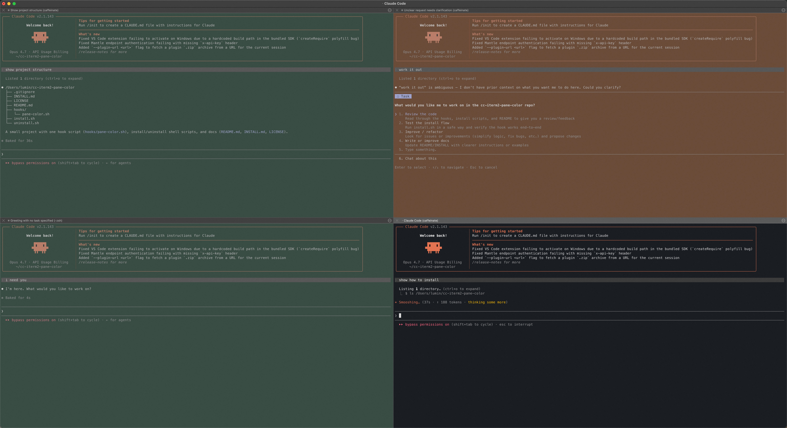

# cc-iterm2-color

> Color-code your iTerm2 panes by Claude Code state, and drop a navigable mark on every prompt you submit. **Green = ready to sign off. Orange = needs your input. Default = still working.** Plus `Cmd+Shift+↑/↓` to jump between your own messages in a long session. Triage a wall of parallel agents at a glance, and never lose track of what you typed — no daemon, no Python runtime, just shell hooks.

Two complementary hooks ship in this repo:

- **`status-bg`** — tints each pane's background based on Claude Code's lifecycle events, so you can triage across many panes at a glance.
- **`mark-input`** — drops an iTerm2 mark on every `UserPromptSubmit`, so you can jump between your own prompts inside a single long session with `Cmd+Shift+↑/↓`.

You can install both (default) or just the one you want.

## status-bg — pane background by state

Running multiple Claude Code sessions in parallel is how you scale yourself — but the panes look identical, so you can't tell which session is **done**, which is **blocked on you**, and which is **still chugging**. You tab through them one by one and miss the one that's been waiting on a permission prompt for ten minutes.

This hook fixes that by tinting each pane's **background** based on Claude Code's lifecycle events. One glance across the grid and you know exactly where to act:

| State | Color | When it triggers | What to do |
|---|---|---|---|
| 🟢 **Ready to sign off** | dark green | Claude finished its turn (`Stop`) | Review the diff, accept or push back |
| 🟠 **Needs you** | dark orange | Permission prompt, or `AskUserQuestion` is waiting | Answer it — Claude is blocked |
| _Working_ | _your default profile bg_ | Running, just launched, or right after you reply | Leave it alone |



Subtle by default — the colors are dark and low-saturation so they don't fight your theme. Tune in one line if you want them louder.

## mark-input — find your own prompts in scrollback

In a long session the transcript fills with tool output and assistant replies, and the things **you typed** drown in the noise. Scrolling up to find "where did I ask about X" turns into a manual hunt.

This hook drops an iTerm2 **mark** at the line where every `UserPromptSubmit` fires. iTerm2 then gives you two things for free:

- **`Cmd+Shift+↑` / `Cmd+Shift+↓`** — jump to the previous / next mark. Each press takes you straight from one of your prompts to the next.
- **Gutter triangle** (optional) — turn on **Preferences → Profiles → Terminal → "Show mark indicators"** and every mark gets a triangle in the left gutter, so all your prompts are visible at a glance when scrolling.

> **Why not a loud colored banner instead?** That was the first idea, and it doesn't work: Claude Code's TUI repaints during streaming and clobbers any text written to the pty. Marks are stored in iTerm2's scrollback model rather than on screen, so they survive the redraws. The gutter triangle gives you the "loud visual" without fighting the renderer.

## How it works

```
Claude Code event ──▶ hook script ──▶ writes OSC to /dev/<parent_tty>
                                         │
                                         ▼
                                    iTerm2 reads pty, parses OSC:
                                      status-bg  → OSC 11   → repaint background
                                      mark-input → OSC 1337 → SetMark in scrollback
```

- Pure shell hooks. Bash + `printf`. No Python runtime at hook time, no AutoLaunch script, no daemon.
- Standard `OSC 11` / `OSC 111` / `OSC 1337 SetMark` escape sequences — `OSC 11` works on any terminal that honors it; `SetMark` is iTerm2-specific.
- Per-pane scoped — split panes are colored and marked independently because OSC targets the writer's pty, not the tab.
- `status-bg` routes around the `Notification` event (which fires both on idle _and_ on attention with no reliable way to tell them apart) and uses `Stop` + `PermissionRequest` + `PreToolUse(matcher=AskUserQuestion)` for clean state mapping.

## Install

```bash
git clone https://github.com/lumincui/cc-iterm2-color.git
cd cc-iterm2-color
bash install.sh                       # both hooks
# or
bash install.sh mark-input            # only the prompt marker
bash install.sh status-bg             # only the background tinting
```

The installer:
1. Copies the selected hook scripts to `~/.claude/hooks/`
2. **Merges** entries into `~/.claude/settings.json` — your existing hooks are preserved
3. Backs up `settings.json` to a timestamped `.bak` before writing

**Restart your Claude Code session** afterward — Claude Code reads the hook config at startup.

Detailed steps in [INSTALL.md](INSTALL.md).

## Configure colors

Edit `~/.claude/hooks/status-bg.sh`, top of file:

```bash
readonly GREEN=$'\e]11;#0a2418\e\\'   # idle
readonly ORANGE=$'\e]11;#502508\e\\'  # attention
```

Hex is standard `#RRGGBB`. Changes take effect on the **next** event — no restart needed for color tweaks.

Suggestions:

| Goal | Green | Orange |
|---|---|---|
| Subtle (default) | `#0a2418` | `#502508` |
| Visible | `#143a20` | `#7a3a10` |
| Loud | `#1f5530` | `#a04a18` |

## Optional: click to reset

If you want a focused pane's color to clear on click — without writing a daemon — bind a pointer action in iTerm2:

> **Preferences → Pointer → +**
> - **Action**: Run Command
> - **Modifier**: ⌘ + Click _(bare left click can't be repurposed without breaking selection)_
> - **Command**: `printf '\e]111\e\\' > \(session.tty)`

Cmd-click any pane → background resets to your profile default. iTerm2 spawns a sub-shell to run the command; the `printf` writes `OSC 111` to that pane's pty, which iTerm2 itself parses as "reset background color".

## Verify

Tail the logs and trigger a turn:

```bash
tail -f "$TMPDIR/claude-status-bg.log" "$TMPDIR/claude-mark-input.log"
```

You should see lines like:

```
==> $TMPDIR/claude-status-bg.log  <==
[14:32:01] event=UserPromptSubmit
[14:32:08] event=PostToolUse
[14:32:14] event=Stop

==> $TMPDIR/claude-mark-input.log <==
[14:32:01] event=UserPromptSubmit
```

The pane background should follow the state table above, and pressing `Cmd+Shift+↑` should jump up to the line where your last prompt was rendered.

## Uninstall

```bash
bash uninstall.sh                       # remove both hooks
bash uninstall.sh mark-input            # only one
bash uninstall.sh status-bg
```

Removes the script(s), removes the corresponding hook entries from `settings.json`, leaves a backup. Restart your session afterward.

## Compatibility

- **macOS + iTerm2** — primary target, tested.
- **Other terminals** — `OSC 11` and `OSC 111` (used by `status-bg`) are standard xterm sequences honored by most modern terminals (Ghostty, kitty, alacritty, Terminal.app). `OSC 1337 SetMark` and `Cmd+Shift+↑/↓` mark navigation (used by `mark-input`) are iTerm2-specific — the script is a no-op on terminals that ignore the sequence. The "Cmd+Click reset" recipe above is also iTerm2-specific.
- **Other shells** — the hooks are `bash`. Your interactive shell can be anything; the hooks are invoked by Claude Code, not by your shell.

## License

MIT
